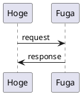
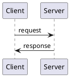

# 目的
PlantUMLの機能検証を行う

# サンプルUML

```uml
@startuml
Foo -> Bar : request
Bar -> Foo : response
@enduml
```


```puml
@startuml
Hoge -> Fuga : request
Fuga -> Hoge : response
@enduml
```


```plantuml
@startuml
Client -> Server : request
Server -> Client : response
@enduml
```
# その他
GitBookやPegmetiteやMarkdown-Preview-Enhancement等との連携も検証する
